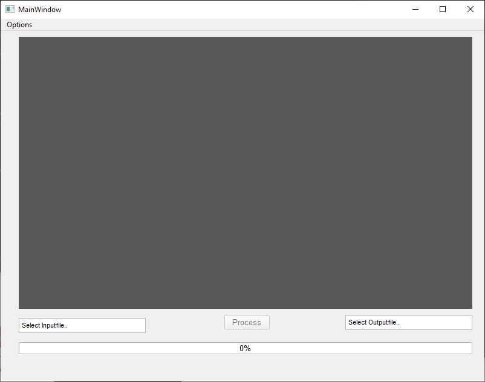

# License_plate_blurring
 QtGUI to blur Vehicle License plates with Yolov3
 
 
 
 
### Installation
[install Anaconda](https://www.anaconda.com/distribution/#download-section)
[install ffmpeg] (https://www.ffmpeg.org/download.html)
```
conda create --name VLP python=3.7
conda activate VLP
pip install -r requirements.txt
conda install -c anaconda cudnn
```
Download modelfile from release and put it into ./model_data/


### Usage
Run main.py with python
```
python main.py
```
Select Input and Output file.
Click Process and wait till it is finished.


### Credits
keras-yolo3 model/training/predicting [qqwweee/keras-yolo3](https://github.com/qqwweee/keras-yolo3)